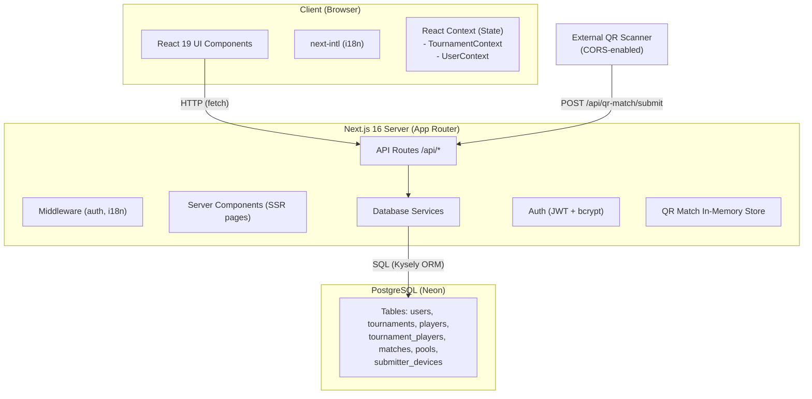
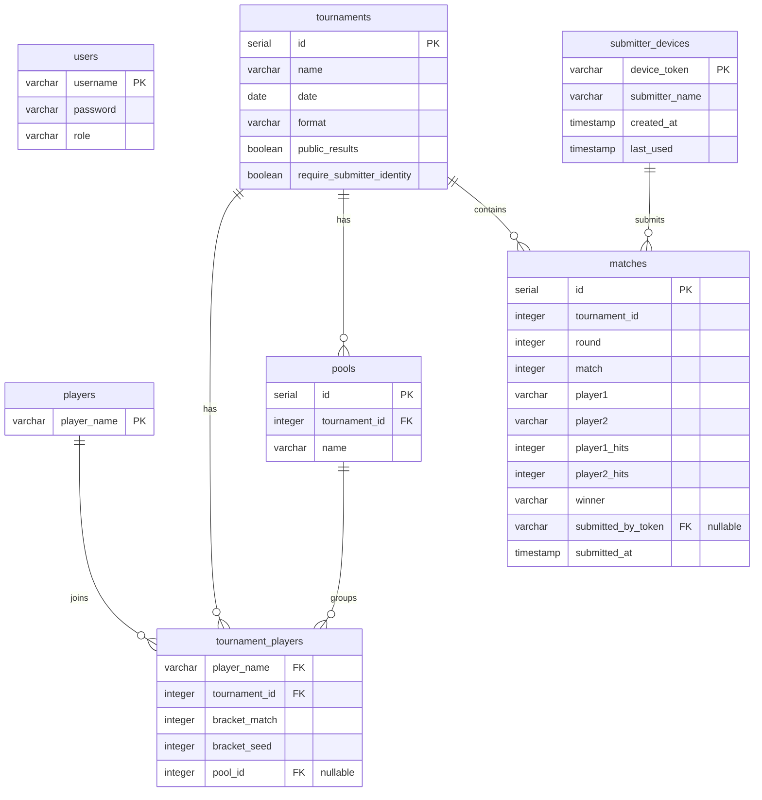
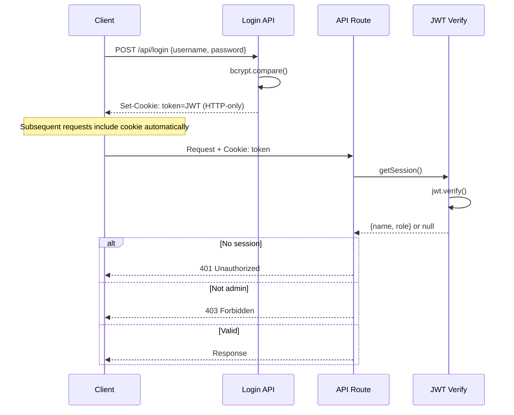
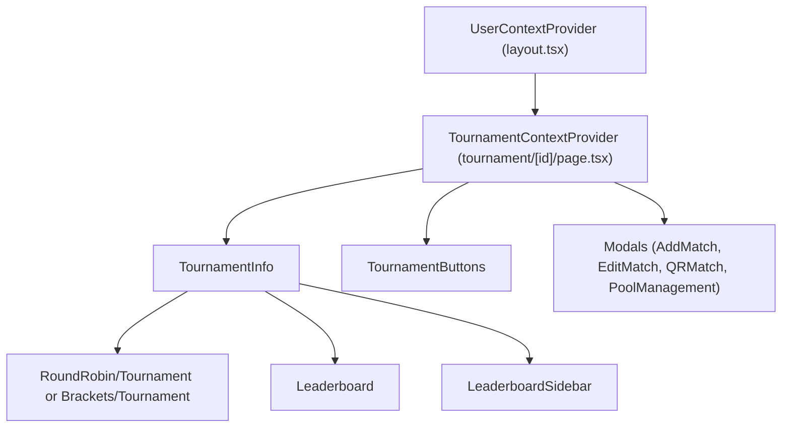
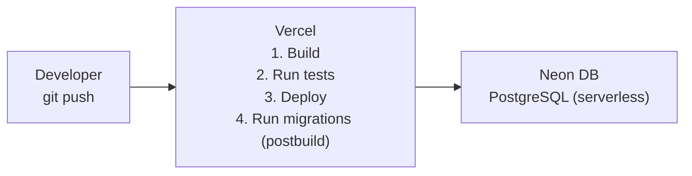

# Architecture Overview

This document describes the high-level architecture of the Tournament App, a full-stack Next.js application for managing fencing tournaments for Helsingin Miekkailijat (Helsinki Fencers).

## System Architecture



## Tech Stack

| Layer            | Technology                                       |
|------------------|--------------------------------------------------|
| Frontend         | React 19, TypeScript, Tailwind CSS               |
| Framework        | Next.js 16 (App Router)                          |
| State Management | React Context API                                |
| i18n             | next-intl (URL-based locale routing)             |
| Backend          | Next.js API Routes                               |
| ORM              | Kysely (type-safe SQL query builder)             |
| Database         | PostgreSQL (hosted on Neon)                      |
| Auth             | JWT tokens (HTTP-only cookies) + bcrypt          |
| QR Codes         | qrcode library                                   |
| Testing          | Vitest + @testing-library/react                  |
| Runtime          | Node.js 24+                                      |
| Deployment       | Vercel                                           |

## Directory Structure

```
tournament-app/
├── docs/                       # Documentation (this directory)
├── migrations/                 # Database migrations (TypeScript, auto-numbered)
│   ├── 001_initial.ts
│   ├── 002_*.ts
│   └── ...
├── scripts/                    # Utility scripts (migration generator)
├── src/
│   ├── app/
│   │   ├── [locale]/           # Internationalized pages
│   │   │   ├── layout.tsx      # Root layout (i18n + UserContext providers)
│   │   │   ├── page.tsx        # Home / login page
│   │   │   ├── select/         # Tournament selection page
│   │   │   ├── tournament/
│   │   │   │   └── [id]/       # Individual tournament page
│   │   │   └── admin/          # Admin panel (protected)
│   │   │       ├── layout.tsx  # Admin auth guard
│   │   │       ├── users/      # User management
│   │   │       ├── devices/    # Device management
│   │   │       ├── players/    # Global player management
│   │   │       └── qr-audit/   # QR submission audit logs
│   │   └── api/                # REST API endpoints
│   │       ├── matches/        # Match CRUD
│   │       ├── newplayer/      # Create player
│   │       ├── addplayer/      # Add player to tournament
│   │       ├── removeplayer/   # Remove player from tournament
│   │       ├── tournament/     # Tournament operations
│   │       │   └── [tournamentId]/
│   │       │       ├── players/    # Tournament players
│   │       │       ├── pools/      # Pool management
│   │       │       └── seed/       # Bracket seeding
│   │       ├── qr-match/       # QR code match system
│   │       │   ├── generate/   # Generate QR match
│   │       │   └── submit/     # Submit QR match results (CORS)
│   │       ├── submitter/      # Device registration (CORS)
│   │       └── admin/          # Admin API endpoints
│   │           ├── users/      # User CRUD
│   │           ├── devices/    # Device management
│   │           ├── players/    # Player CRUD
│   │           └── qr-audit/   # Audit log retrieval
│   ├── components/             # React components
│   │   ├── Admin/              # Admin panel components
│   │   ├── Leaderboards/       # Rankings display
│   │   └── Results/            # Tournament result views
│   │       ├── Brackets/       # Bracket tournament display
│   │       └── RoundRobin/     # Round-robin tournament display
│   ├── context/                # React Context providers
│   │   ├── TournamentContext.tsx
│   │   └── UserContext.tsx
│   ├── database/               # Database service layer
│   ├── helpers/                # Utility functions
│   ├── languages/              # Translation files (fi, en, se, ee)
│   └── types/                  # TypeScript type definitions
├── docker-compose.yaml         # Local PostgreSQL + Adminer
├── package.json
├── tsconfig.json
├── tailwind.config.ts
└── vitest.config.ts
```

## Database Schema



### Table Relationships

- **users**: Standalone table for authentication. No FK relationships.
- **tournaments**: Central entity. Referenced by matches, tournament_players, and pools.
- **players**: Global player registry. Referenced by tournament_players.
- **tournament_players**: Join table linking players to tournaments. Holds bracket positioning and pool assignment.
- **matches**: Records individual match results within a tournament.
- **pools**: Groups within round-robin tournaments. Players are assigned to pools via tournament_players.pool_id.
- **submitter_devices**: Registered external devices for QR match submission. Referenced by matches.submitted_by_token.

## Authentication Architecture



- **JWT tokens** are stored in HTTP-only cookies for security (not accessible to JavaScript).
- **Password hashing** uses bcrypt for secure storage.
- **Role-based access**: Two roles (`admin`, `user`). Admin routes check `role === "admin"`.
- **Session helper** (`getSession()`) extracts and verifies JWT from the cookie on each API call.

## State Management

The app uses React Context for global state, with two primary providers:

### UserContext
- Holds authenticated user info (`name`, `role`)
- Fetched on app mount via `getSession()`
- Used by navbar, admin guards, and permission checks

### TournamentContext
- Holds current tournament data, players, pools, and UI state
- Fetched when a tournament page loads
- Provides: `tournament`, `players`, `pools`, `activeRound`, `hidden` (leaderboard toggle)
- Auto-creates "Pool 1" for round-robin tournaments with no pools



## Internationalization

The app supports 4 languages via `next-intl` with URL-based routing:

| Locale | Language | URL Prefix |
|--------|----------|------------|
| `fi`   | Finnish  | `/fi/...`  |
| `en`   | English  | `/en/...`  |
| `se`   | Swedish  | `/se/...`  |
| `ee`   | Estonian | `/ee/...`  |

- Finnish (`fi.json`) is the **source of truth** for TypeScript types
- Middleware handles locale detection and routing
- All UI text uses `useTranslations()` hook with namespace-based keys

## Deployment Architecture



- **Vercel** hosts the Next.js application with automatic deployments on push
- **Neon** provides serverless PostgreSQL with connection pooling
- **Migrations** run automatically after successful builds via the `postbuild` script
- **Environment variables** (`POSTGRES_URL`, `JWT_SECRET`, `CORS_ALLOWED_ORIGIN`) are configured in Vercel dashboard

## Key Design Decisions

1. **Kysely over Prisma**: Chosen for type-safe SQL queries without a heavy ORM abstraction, giving more control over query construction.

2. **React Context over Redux**: Simpler state management suitable for the app's scope. Two focused contexts rather than a monolithic store.

3. **URL-based i18n**: Locale in URL path (`/fi/`, `/en/`) enables proper SEO and shareable localized URLs.

4. **In-memory QR match store**: QR match metadata is stored in-memory with 1-hour expiration rather than in the database, keeping the system simple for short-lived match sessions.

5. **HTTP-only JWT cookies**: Prevents XSS attacks from accessing auth tokens while maintaining stateless authentication.

6. **Feature-based component organization**: Components grouped by feature (Admin, Leaderboards, Results) rather than by type (buttons, forms), making related code easy to find.
