# Interaction Diagrams

This document illustrates the key interaction flows in the Tournament App using sequence diagrams in ASCII art.

## Table of Contents

- [Authentication Flow](#authentication-flow)
- [Tournament Lifecycle](#tournament-lifecycle)
- [Round-Robin Match Entry](#round-robin-match-entry)
- [Bracket Tournament Seeding](#bracket-tournament-seeding)
- [QR Code Match Flow](#qr-code-match-flow)
- [Device Registration Flow](#device-registration-flow)
- [Pool Management Flow](#pool-management-flow)
- [Bulk Match Entry Flow](#bulk-match-entry-flow)

---

## Authentication Flow

### Login

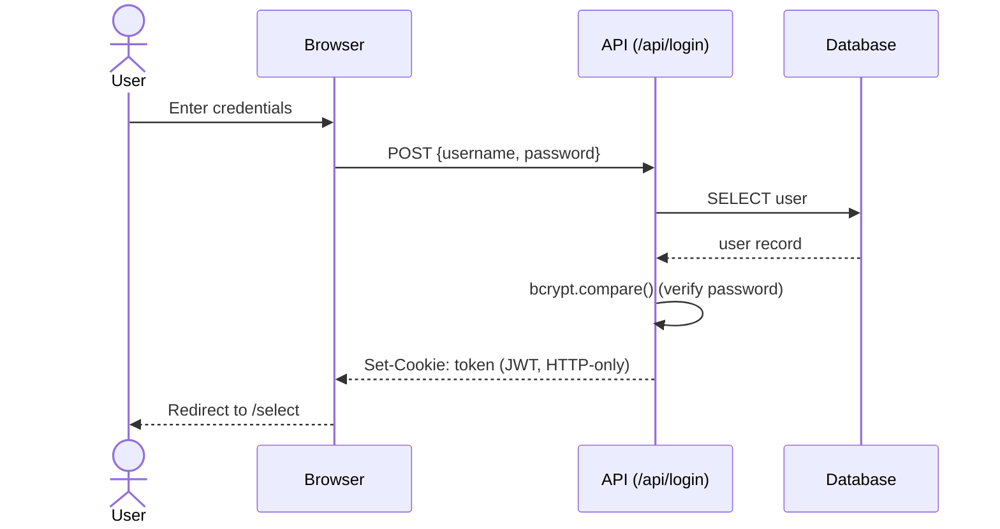

### Session Verification (on every API call)

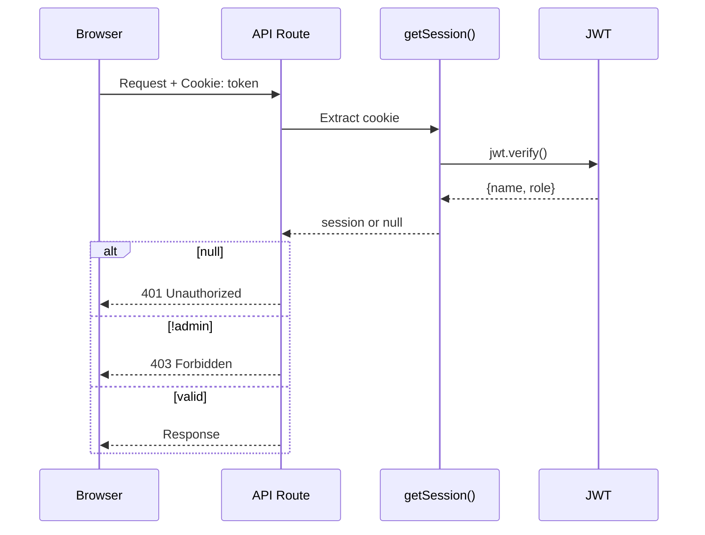

---

## Tournament Lifecycle

### Creating a Tournament

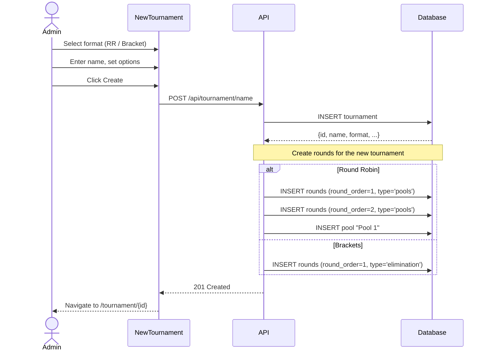

### Loading a Tournament Page

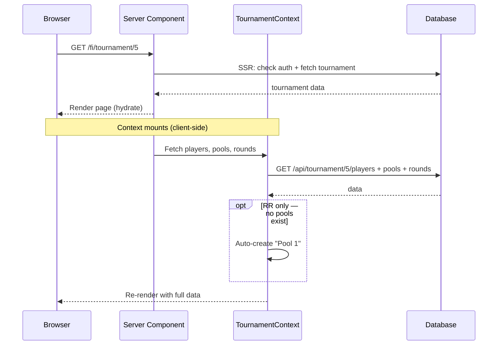

---

## Round-Robin Match Entry

### Single Match Entry

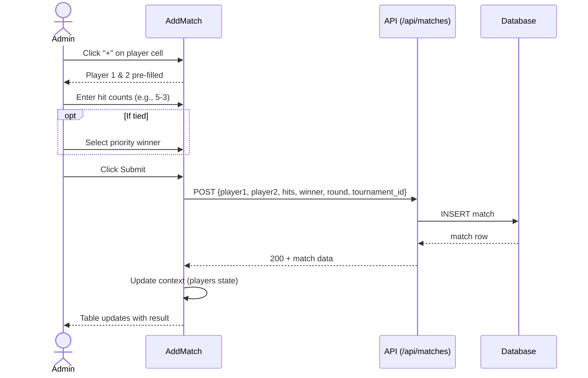

### Match Editing

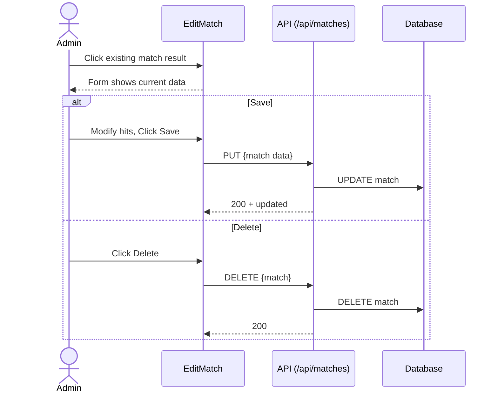

---

## Bracket Tournament Seeding

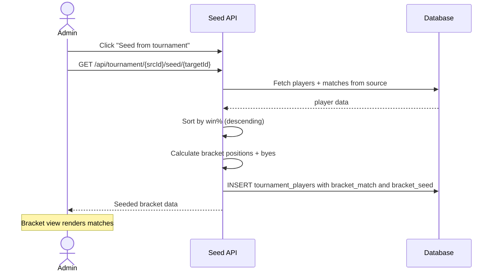

---

## QR Code Match Flow

This is the complete lifecycle of a QR-code-based match:

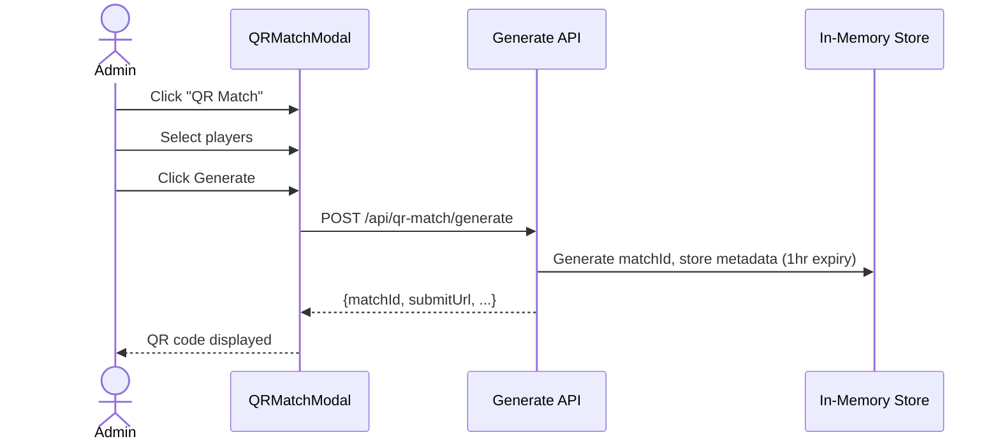

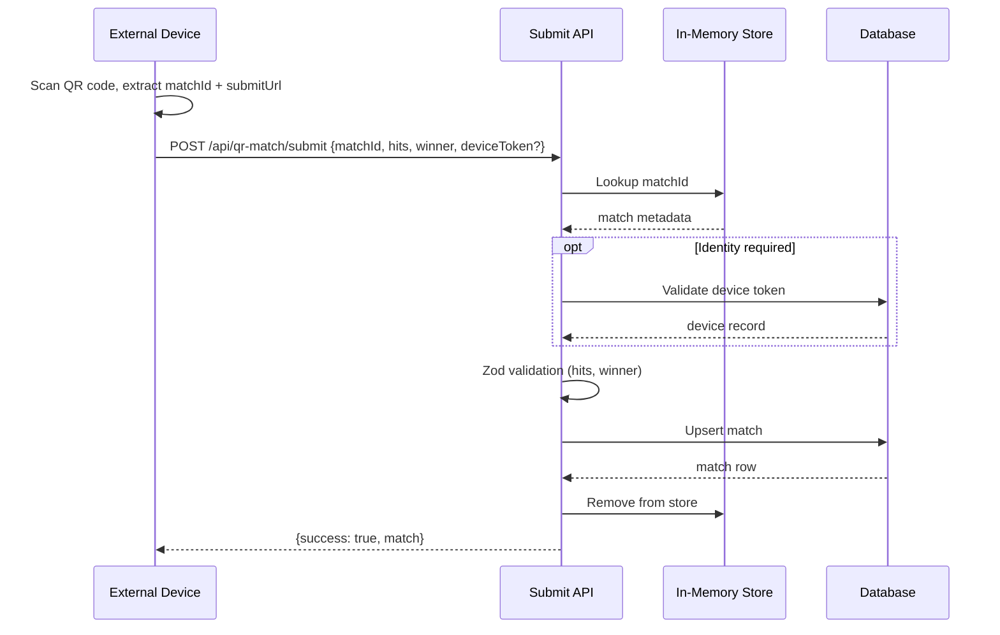

---

## Device Registration Flow

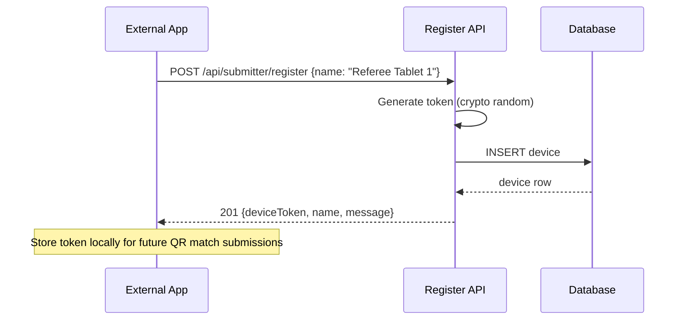

---

## Pool Management Flow

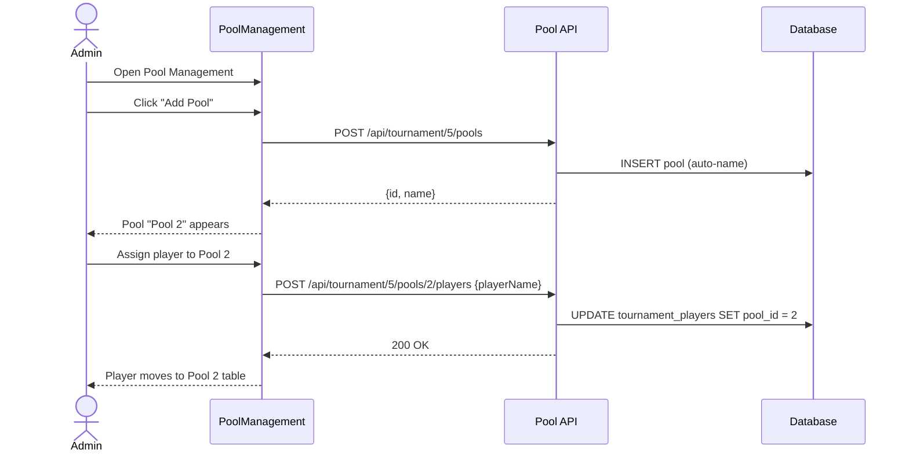

---

## Bulk Match Entry Flow

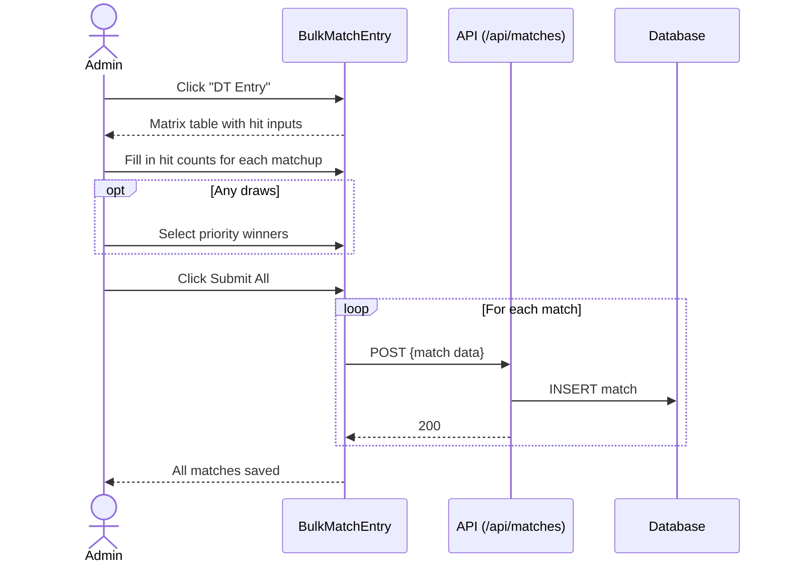

---

## Admin User Management Flow

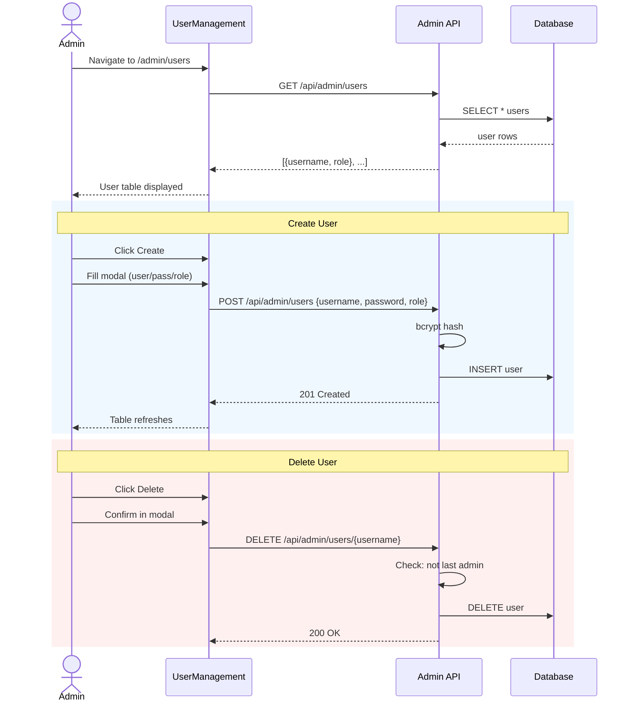

---

## Component Rendering Flow

### Tournament Page Component Tree

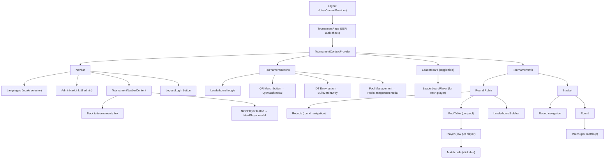
